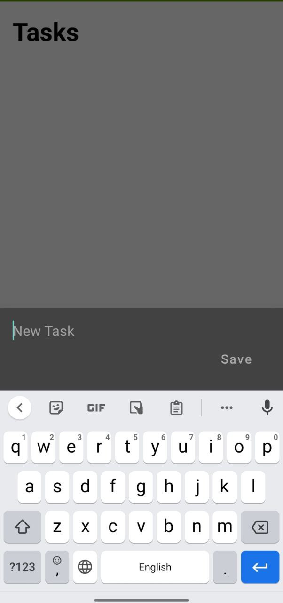
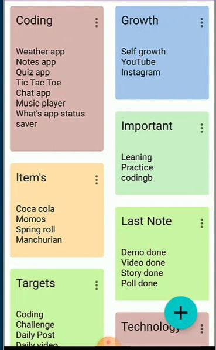

  <h1>Note App</h1>
  
The Note App is a robust application designed to help users record, organize, and manage their notes and daily tasks efficiently. With features like reminders, task prioritization, and a user-friendly interface, the app simplifies note-taking and task management.

  
  <h2>Key Features</h2>
  <ul>
    <li>Record and organize notes and tasks</li>
    <li>Add reminders for important tasks</li>
    <li>Prioritize notes for better task management</li>
    <li>Simple interface for adding, editing, and deleting notes</li>
  </ul>
  
  <h2>Technologies Used</h2>
  
This app is built using Kotlin and follows the MVVM (Model-View-ViewModel) architecture, ensuring a clean separation of concerns and an easier testing process. LiveData is utilized for observing changes in data, allowing the UI to update automatically. Room is used for data persistence, making it easy to work with SQLite databases. Animations enhance the user experience, and the Navigation component simplifies navigation between different parts of the app.

  
  <h3>MVVM</h3>
  
MVVM stands for Model-View-ViewModel. It's an architectural pattern that separates the development of the graphical user interface from the development of the business logic or back-end logic (the data model). The View model in MVVM is responsible for exposing the data objects from the Model in such a way that those objects are easily managed and presented. This separation allows for better modularization of an application and makes it easier to test, maintain, and evolve.

  
  <h3>LiveData</h3>
  
LiveData is an observable data holder class that is lifecycle-aware, meaning it respects the lifecycle of other app components, such as activities, fragments, or services. This quality ensures LiveData only updates app component observers that are in an active lifecycle state.

  
  <h3>Room</h3>
  
Room is an abstraction layer over SQLite that allows for more robust database access while harnessing the full power of SQLite. It helps to create a cache of your app's data on a device that's running your app, which allows your app to work even when there's no network connection.

  
  <h3>Animation</h3>
  
Animations are used to improve the user experience by providing visual feedback and making the app more interactive and engaging.

  
  <h3>Navigation Component</h3>
  
The Navigation component is a part of Android Jetpack that simplifies the implementation of navigation in an Android app. It manages the navigation logic in a clear and consistent way.

    <h2 class="video-title">The Application</h2>

  
  
  

